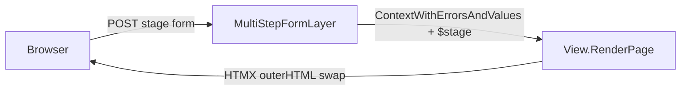

# Multi-step forms

Build a `MultiStepForm` wrapper that renders only the active stage, carries prior values forward, and keeps `"$stage"` in request context so later steps can depend on earlier input. Keep transport aligned with current forms by letting callers wire `MultiStageURL` into the existing boosted-post flow, and let the view re-render the same form HTML on POST.

- Add `[components/multi_step_form.go](/home/rajtagore/lago/components/multi_step_form.go)` with a `MultiStepForm` component that stores stage definitions as `[]components.FormInterface` so each step can still be a normal `FormComponent[T]`.
- Make `MultiStepForm` implement `PageInterface`, `ParentInterface`, `MutableParentInterface`, and `FormInterface`; expose only the active stage in its rendered child tree so inactive inputs are not parsed.
- Thread `Values`, `Stage`, and `MultiStageURL` through the render path; use the current values map to emit hidden carry-forward inputs, skipping names that belong to the active stage.
- Add `[views/layer_multistep_form.go](/home/rajtagore/lago/views/layer_multistep_form.go)` for POST handling: parse the active stage, merge values/errors with `ContextWithErrorsAndValues` from `[views/context.go](/home/rajtagore/lago/views/context.go)`, inject `"$stage"` into context, and advance the stage on success until the last step.
- Keep render semantics inside existing `View.RenderPage` / 422 path in `[views/views.go](/home/rajtagore/lago/views/views.go)`; no redirect or finish callback in first pass.
- Extend hidden-mode support in `[components/input_checkbox.go](/home/rajtagore/lago/components/input_checkbox.go)`, `[components/input_date.go](/home/rajtagore/lago/components/input_date.go)`, `[components/input_time.go](/home/rajtagore/lago/components/input_time.go)`, and `[components/input_datetime.go](/home/rajtagore/lago/components/input_datetime.go)` so carried-forward state stays typed instead of falling back to string-only serialization.
- Add focused tests for stage switching, hidden carry-forward fields, and validation re-render. Extend `[components/input_test.go](/home/rajtagore/lago/components/input_test.go)` and add new tests beside the new component/layer files.

Call sites can keep using `[components/form_listen_boosted_post.go](/home/rajtagore/lago/components/form_listen_boosted_post.go)` and `[getters/form_bubbling.go](/home/rajtagore/lago/getters/form_bubbling.go)` with `MultiStageURL` as action URL, so this slots into current full-page/modal form flow without new transport JS.